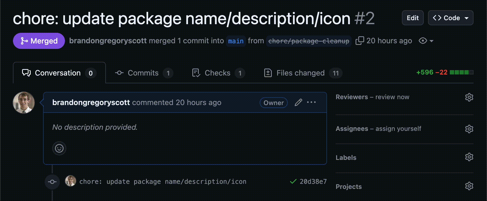
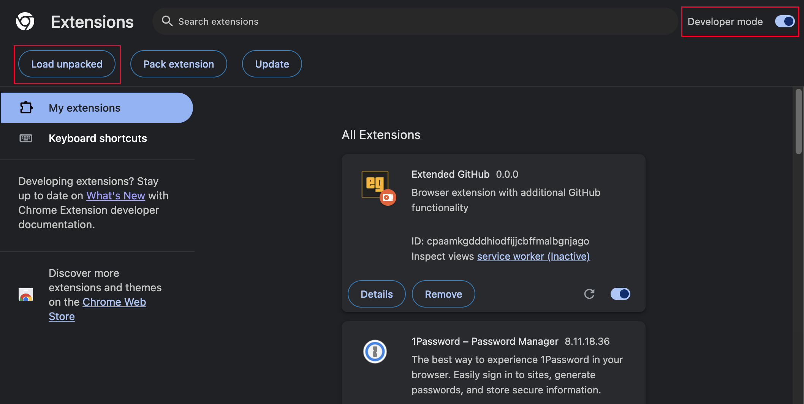

# Extended GitHub

Browser extension with additional GitHub functionality. You probably don't need it, but I do.

## Features

- Auto assign self to pull request



## Installation

This extension is currently not distributed via any of the browser stores. You'll have to build it from source and install it manually.

```sh
# Clone the repo
git clone git@github.com:brandongregoryscott/extended-github.git
cd extended-github

# Ensure you're on the right node version
nvm use

# Install packages
npm install

# Build the extension
npm run zip
```

You should now have a `dist` folder with a zip file and an unzipped `chrome-mv3` directory. In Google Chrome, open up the [extensions manager](chrome://extensions) and turn `Developer Mode` on. Then, click the `Load unpacked` button in the top left and select the `dist/chrome-mv3` folder. You're all set!



### Disclaimer

This extension is not affiliated with GitHub, Inc. in any way. Use the extension at your own risk.
